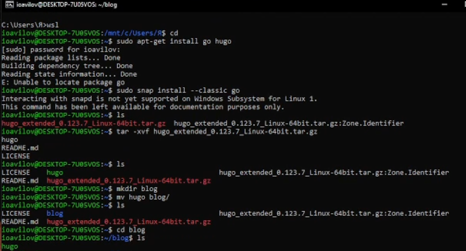
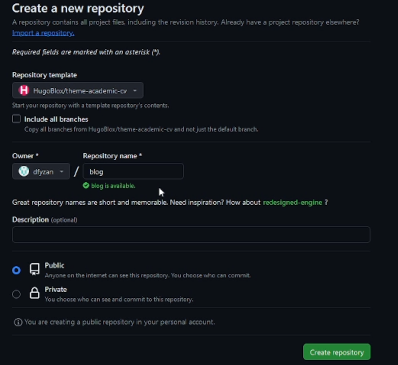
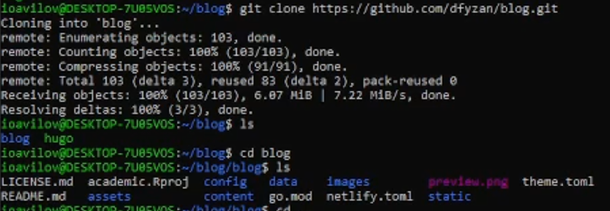
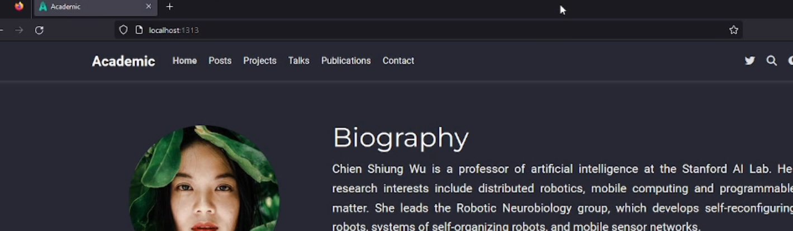
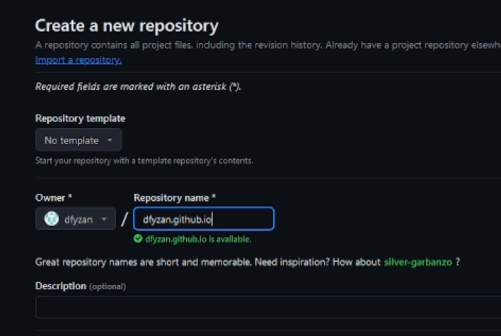
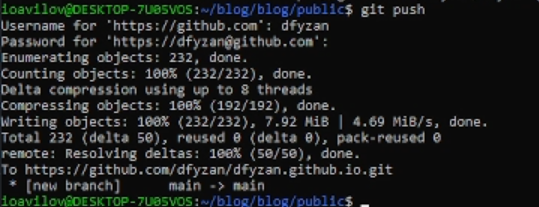
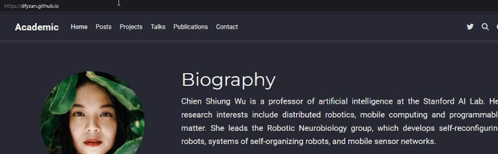

---
## Front matter
title: "Отчёт по выполнению первого этапа индивидуального проекта"
author: "Авилов Иван Олегович"

## Generic otions
lang: ru-RU

## Bibliography
bibliography: bib/cite.bib
csl: pandoc/csl/gost-r-7-0-5-2008-numeric.csl

## Pdf output format
toc: true # Table of contents
toc-depth: 2
lof: true # List of figures
lot: true # List of tables
fontsize: 12pt
linestretch: 1.5
papersize: a4
documentclass: scrreprt
## I18n polyglossia
polyglossia-lang:
  name: russian
  options:
	- spelling=modern
	- babelshorthands=true
polyglossia-otherlangs:
  name: english
## I18n babel
babel-lang: russian
babel-otherlangs: english
## Fonts
mainfont: PT Serif
romanfont: PT Serif
sansfont: PT Sans
monofont: PT Mono
mainfontoptions: Ligatures=TeX
romanfontoptions: Ligatures=TeX
sansfontoptions: Ligatures=TeX,Scale=MatchLowercase
monofontoptions: Scale=MatchLowercase,Scale=0.9
## Biblatex
biblatex: true
biblio-style: "gost-numeric"
biblatexoptions:
  - parentracker=true
  - backend=biber
  - hyperref=auto
  - language=auto
  - autolang=other*
  - citestyle=gost-numeric
## Pandoc-crossref LaTeX customization
figureTitle: "Рис."
tableTitle: "Таблица"
listingTitle: "Листинг"
lofTitle: "Список иллюстраций"
lotTitle: "Список таблиц"
lolTitle: "Листинги"
## Misc options
indent: true
header-includes:
  - \usepackage{indentfirst}
  - \usepackage{float} # keep figures where there are in the text
  - \floatplacement{figure}{H} # keep figures where there are in the text
typora-copy-images-to: ./images
---

# Цель работы

Цель работы - реализовать свой собственный сайт, свою визитную карточку. 

В данном этапе необходимо установить необходимое ПО и разместить шаблон сайта на Github pages. Следующие работы будут нацелены на наполнение сайта контентом.

# Задание

- Установить необходимое программное обеспечение.
- Скачать шаблон темы сайта.
- Разместить его на хостинге git.
- Установить параметр для *URLs* сайта.
- Разместить заготовку сайта на *Github pages*.

# Выполнение лабораторной работы

Загружаем и распаковываем бинарный файл, который включает в себя все необходимые зависимости.

Создаём новый репозиторий из шаблона сайта и клонируем его.

С помощью команды "./hugo server" загружаем необходимые модули, генерируем сайт и хостим его по адресу localhost:1313.

Создаём репозиторий с названием "dfyzan.github.io", клонируем в папку "public", опять генерируем сайт и отправляем данные на github.

Переходим по адресу dfyzan.github.io и проверяем, что сайт работает.

Нам не потребовалось устанавливать параметр для URLs нашего сайта, поскольку сайт работает без этого. Скорее всего, это было необходимо раньше, но сейчас, судя по всему, можно это не делать.

# Выводы

В данной работе я создал заготовку сайта, которую в будущем можно наполнить информацией, опытом, навыками и создать собственную визитную карточку. 

В процессе я научился работать с генератором статичный сайтов hugo, а также научился публиковать свои собственные сайты на сервис github pages.

